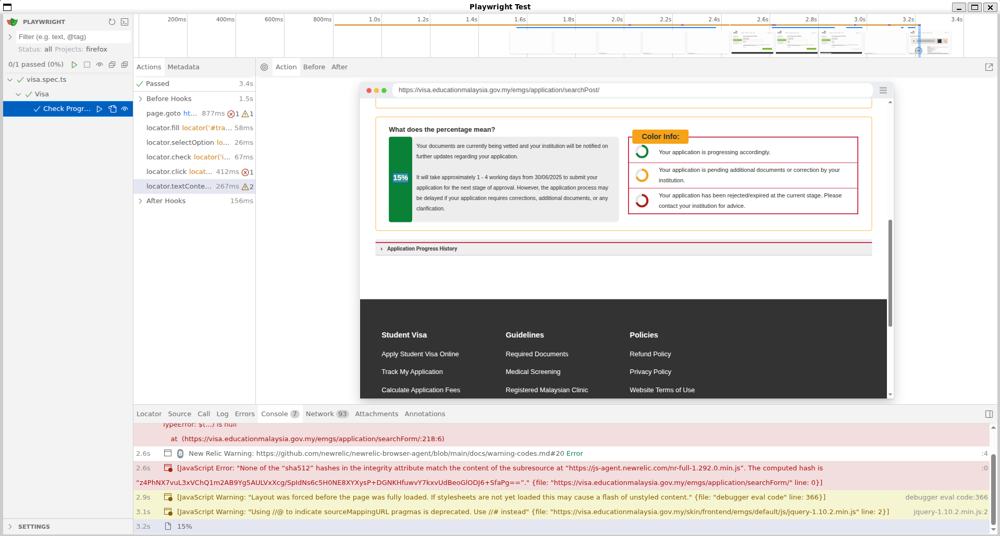

# Playwright Visa Automation

This is an automation script to get the latest visa progress on [Education Malaysia website](https://visa.educationmalaysia.gov.my/).

## Prerequisites

You need to install these programs:
1. Node and NPM.
2. PNPM.
3. Playwright: `pnpm exec playwright install --with-deps`

## Run The Test

There are several modes where you can run the test:
- Normal: `npx playwright test`
- UI mode: This will open the Playwright Test window, where you can choose which test you want to run. More details [here](https://playwright.dev/docs/running-tests#run-tests-in-ui-mode).
- Headed mode: This will open the browser so that you can see how the automation test interacts with the browser. More details [here](https://playwright.dev/docs/running-tests#run-tests-in-ui-mode). I personally choose the UI mode.

This is the screenshot when running the UI mode:

